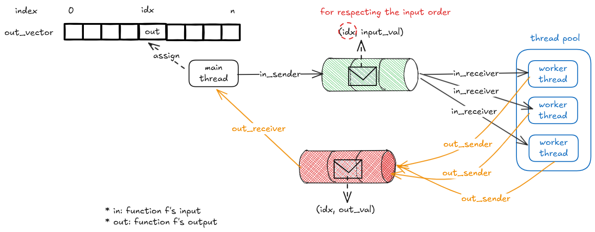

# Implementation Idea 

Constraints:

1. only use channel as synchronization mechanism
1. respect the order of inputs



Why use 2 channels, one for inputs, one for outputs?

If we only use one channel for both inputs and outputs, 

1. we would have to deal with the complexity of distinguishing between input and output messages
1. cannot control who is receiving the messages, the workers or the main thread
1. hard to break the loop of receiving message from channel when all tasks are done

If we use two channels, one for inputs and one for outputs,

1. we can easily distinguish between input and output messages
1. control the flow of messages, workers only receive from input channel, main thread only receives from output channel

# Example Run

```bash
tim@tim-virtual-machine ~/g/S/w/parallel_map (main)> cargo run samples/sleepy_print
6 squared is 36
10 squared is 100
4 squared is 16
8 squared is 64
7 squared is 49
9 squared is 81
1 squared is 1
5 squared is 25
2 squared is 4
3 squared is 9
18 squared is 324
5 squared is 25
11 squared is 121
20 squared is 400
12 squared is 144
squares: [36, 49, 64, 81, 100, 1, 4, 9, 16, 25, 144, 324, 121, 25, 400]
```
